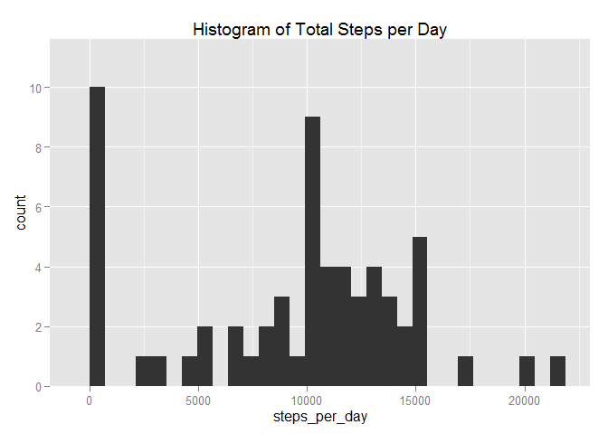
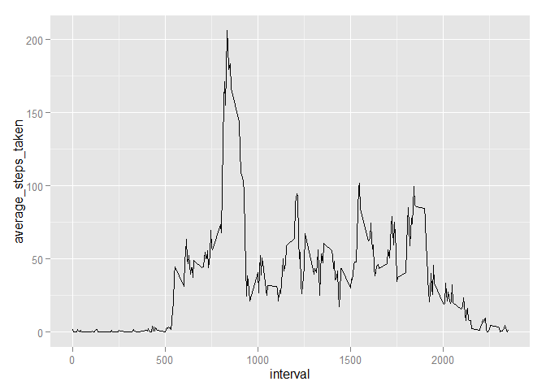
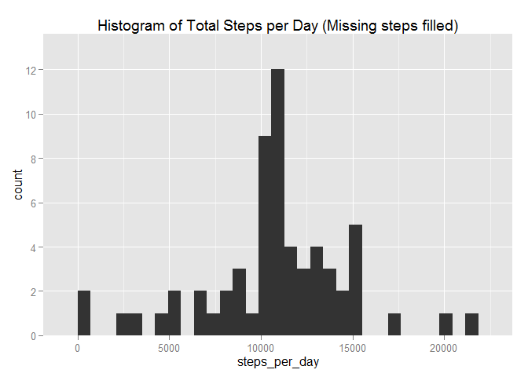
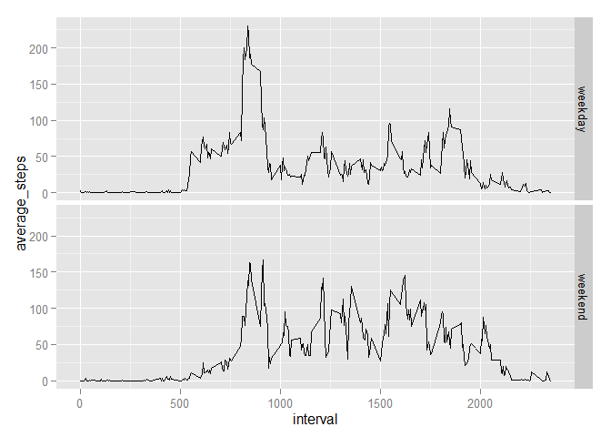

# Reproducible Research: Peer Assessment 1


## Loading and preprocessing the data


```r
dat <- read.csv(file = unzip(zipfile = "activity.zip"))
library(dplyr)
tbl_dat <- tbl_df(dat)
```

## What is mean total number of steps taken per day?


```r
by_date <- group_by(tbl_dat, date)
steps_summary <- summarise(by_date, steps_per_day = sum(steps, na.rm = TRUE))
library(ggplot2)
qplot(steps_per_day, data = steps_summary, main = "Histogram of Total Steps per Day") + scale_y_discrete(breaks = seq(0,11,2))
```

 

```r
mean_steps = mean(steps_summary$steps_per_day, na.rm = TRUE)
median_steps = median(steps_summary$steps_per_day, na.rm = TRUE)
```

Mean of steps taken per day: **9354.23**  
Median of steps taken per day: **10395.00**

## What is the average daily activity pattern?


```r
by_interval <- group_by(tbl_dat, interval)
interval_summary <- summarise(by_interval, average_steps_taken = mean(steps, na.rm = TRUE))
qplot(interval, average_steps_taken, data = interval_summary, geom = "line" )
```

 

```r
interval_max <- filter(interval_summary, average_steps_taken == max(average_steps_taken))
```

The 5-minute interval, **835**, on average, contains the maximum number of steps of **206.17**.

## Imputing missing values


```r
num_NA <- sum(is.na(tbl_dat$steps))
```
The total number of missing values in the dataset is **2304**.  
**Strategy:** *The missing values will be filled in using the mean for that 5-minute interval*. 


```r
# Returns the indices of the dataframe for which there are missing steps.
na_index <- which(is.na(tbl_dat$steps))
# Returns the list of intervals corresponding to the missing steps 
na_interval <- tbl_dat[na_index, "interval"]
# Consolidating the list of replacement steps
replacement.steps <- interval_summary[match(na_interval$interval, interval_summary$interval), "average_steps_taken"]
# Finally create a new dataset with the missing steps filled in
new_tbl_dat <- tbl_dat
new_tbl_dat$steps <- replace(new_tbl_dat$steps, na_index, replacement.steps$average_steps_taken)
```

```r
num_NA <- sum(is.na(new_tbl_dat$steps))
```
The total number of missing values in the *new* dataset is **0**.


```r
new_by_date <- group_by(new_tbl_dat, date)
new_steps_summary <- summarise(new_by_date, steps_per_day = sum(steps, na.rm = TRUE))
library(ggplot2)
qplot(steps_per_day, data = new_steps_summary, main = "Histogram of Total Steps per Day (Missing steps filled)") + scale_y_discrete(breaks = seq(0,13,2))
```

 

```r
new_mean_steps = mean(new_steps_summary$steps_per_day)
new_median_steps = median(new_steps_summary$steps_per_day)
```

Mean of steps taken per day: **10766.19**  
Median of steps taken per day: **10766.19**  

The mean and median are greater here compared to the previous calculations. The input of missing values raises the total number of steps per day, which then account for the higher mean and median.


## Are there differences in activity patterns between weekdays and weekends?


```r
new_tbl_dat <- mutate(new_tbl_dat, day = weekdays(as.Date(date)))
new_tbl_dat$day_type <- as.factor(ifelse(new_tbl_dat$day %in% c("Saturday", "Sunday"), "weekend", "weekday"))
new_by_interval_by_dayType <- group_by(new_tbl_dat, interval, day_type)
new_interval_summary  <- summarise(new_by_interval_by_dayType, average_steps = mean(steps))
qplot(interval, average_steps, facets = day_type~., data = new_interval_summary, geom = "line")
```

 
